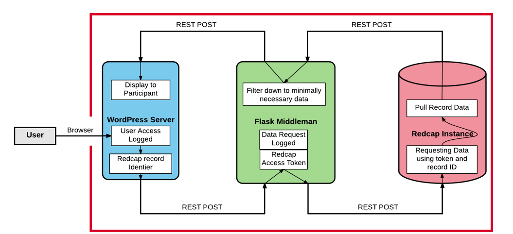

# REDCapToWordPress WordPress plugin

## Description
This plugin is designed to create a patient portal for medical or other research studies
that are patient-driven, meaning that the study participant needs to enter day but also needs
access to the data they input as well as study results that pertain to them. The links REDCap projects 
to WordPress websites, giving patients access to their personal data that they share with research projects.

### Pre-requisite plugins:
    
This plugin requires the [Native PHP Sessions for WordPress plugin](https://wordpress.org/plugins/wp-native-php-sessions/).
Be sure to install this before installing REDCapToWordPress.

## Setting up the Plugin
Download the REDCapToWordPress repository.

You'll have to manually configure a lot of the variables for the plugin.

In the **config.ini** file, add your REDCap API token and the middleman server IP address:port. More details on
these are below.
 
Once all the changes are made, add the REDCapToWordPress folder to the plugins
folder in WordPress. You can either directly upload the folder to your hosting server to 
/htdocs/wp_content/plugins, or you can zip the folder and upload it through the admin backend
view of WordPress.

### Creating landing pages

#### Registration/Admin Page

This is the page where new study subjects are signed up for the study.
The default settings give only admin level users access to this page. To give anyone
access, some changes need to be made.

Create a page on your site with the url **yoursite.com/registration**.

On this page, add the shortcode **[register_form]**.

#### Login Page

This is the page where returning users and administrators can log in to view their 
information. This page dovetails off of the built-in wordpress login functions, 
but adds functionality so that users can be linked to their records in REDCap.

Create a page on your site with the url **yoursite.com/login**.

On this page, add the shortcode **[login_form]**.

#### Patient Account Page

This is where the magic happens. This handles the pulling of relevant patient information
from REDCap to this patient portal. The current setup of this plugin is optimized for the 
FindMyVariant study patient portal.
To configure the layout for your study, see the /includes/patient_profile.php file to adjust
what your patients will see upon loading this page.

Create a page on your site with the url **yoursite.com/my_account**.

On this page, add the shortcode **[my_account]**.

## Building the Middleman Server

### Description and Rationale

Since this plugin is designed to work with REDCap, which is generally used to store 
Personal Health Information (PHI), we took extra precaution when building this plugin
for the FindMyVariant study. 

Your REDCap study project will have an API you can activate so that you can programmaticallydf
access your study data. The issue is that REDCap only gives you one security token per user of 
your project that can be used to
access your entire project. If a bad actor were to compromise your site and get a hold of your
token, they would have complete access to all your REDCap data. As far as I'm aware, tokens cannot
be created to have limited access to only individual records.

We use a middleman server with very narrow permission for
which IP addresses can query the server. We store the REDCap API token on this server
and have built a Flask app API that can be run on this middleman. This is not an airtight
solution, but it adds another layer of protection to your data. A diagram of the information
flow is shown.

### Configuration

All the Middleman server code is located in the **Middleman server** folder.

In the **config.json** file, add your institution's REDCap url and 
add your study project's API token. If you don't know how to find either of these, contact your 
REDCap administrator.

This is where the real fun begins. REDCap project and record schemas are going to wildly vary
across studies. In order to make this plugin mesh with your project, you'll need to go through
the **Flask_API.py** and **RedCap_API.py** files to customize the variable names so they match
your REDCap record variable field names. REDCap has more information on how to find the variable
names from the records. I've tried to include lots of guiding comments in those two files.

Keep in mind, the default configuration is setup for FindMyVariant.

### Activating the middleman server

Upload the folder **Middleman Server** to a server with the server settings such that only your
website IP address can make HTTP RESTful requests.

Finally, download gunicorn or a similar library that can spin up multiple instances of
a flask app. Run **Flask_API.py** as a flask app.

This should cover it. Feel free to email me with questions: trberg@uw.edu

